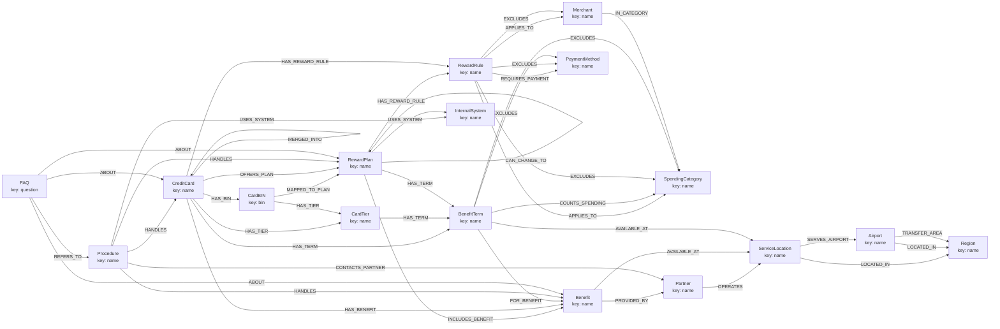

# 台新信用卡權益知識圖譜 — Model Diagram

```mermaid
flowchart LR
    CreditCard["CreditCard<br/>key: name"]
    CardTier["CardTier<br/>key: name"]
    CardBIN["CardBIN<br/>key: bin"]
    RewardPlan["RewardPlan<br/>key: name"]
    RewardRule["RewardRule<br/>key: name"]
    Benefit["Benefit<br/>key: name"]
    BenefitTerm["BenefitTerm<br/>key: name"]
    SpendingCategory["SpendingCategory<br/>key: name"]
    Merchant["Merchant<br/>key: name"]
    PaymentMethod["PaymentMethod<br/>key: name"]
    Partner["Partner<br/>key: name"]
    ServiceLocation["ServiceLocation<br/>key: name"]
    Airport["Airport<br/>key: name"]
    Region["Region<br/>key: name"]
    Procedure["Procedure<br/>key: name"]
    InternalSystem["InternalSystem<br/>key: name"]
    FAQ["FAQ<br/>key: question"]
    CreditCard -->|HAS_TIER| CardTier
    CardBIN -->|HAS_TIER| CardTier
    CreditCard -->|HAS_BIN| CardBIN
    CardBIN -->|MAPPED_TO_PLAN| RewardPlan
    CreditCard -->|OFFERS_PLAN| RewardPlan
    RewardPlan -->|SUB_PLAN_OF| RewardPlan
    RewardPlan -->|CAN_CHANGE_TO| RewardPlan
    RewardPlan -->|HAS_REWARD_RULE| RewardRule
    CreditCard -->|HAS_REWARD_RULE| RewardRule
    RewardPlan -->|INCLUDES_BENEFIT| Benefit
    CreditCard -->|HAS_BENEFIT| Benefit
    CreditCard -->|HAS_TERM| BenefitTerm
    CardTier -->|HAS_TERM| BenefitTerm
    RewardPlan -->|HAS_TERM| BenefitTerm
    BenefitTerm -->|FOR_BENEFIT| Benefit
    RewardRule -->|APPLIES_TO| SpendingCategory
    RewardRule -->|APPLIES_TO| Merchant
    RewardRule -->|REQUIRES_PAYMENT| PaymentMethod
    BenefitTerm -->|COUNTS_SPENDING| SpendingCategory
    RewardRule -->|EXCLUDES| SpendingCategory
    RewardRule -->|EXCLUDES| Merchant
    RewardRule -->|EXCLUDES| PaymentMethod
    BenefitTerm -->|EXCLUDES| SpendingCategory
    BenefitTerm -->|EXCLUDES| PaymentMethod
    Merchant -->|IN_CATEGORY| SpendingCategory
    Benefit -->|PROVIDED_BY| Partner
    Partner -->|OPERATES| ServiceLocation
    Benefit -->|AVAILABLE_AT| ServiceLocation
    BenefitTerm -->|AVAILABLE_AT| ServiceLocation
    ServiceLocation -->|SERVES_AIRPORT| Airport
    ServiceLocation -->|LOCATED_IN| Region
    Airport -->|LOCATED_IN| Region
    Airport -->|TRANSFER_AREA| Region
    CreditCard -->|MERGED_INTO| CreditCard
    Procedure -->|HANDLES| Benefit
    Procedure -->|HANDLES| RewardPlan
    Procedure -->|HANDLES| CreditCard
    Procedure -->|USES_SYSTEM| InternalSystem
    RewardPlan -->|USES_SYSTEM| InternalSystem
    Procedure -->|CONTACTS_PARTNER| Partner
    FAQ -->|ABOUT| Benefit
    FAQ -->|ABOUT| RewardPlan
    FAQ -->|ABOUT| CreditCard
    FAQ -->|REFERS_TO| Procedure
```
